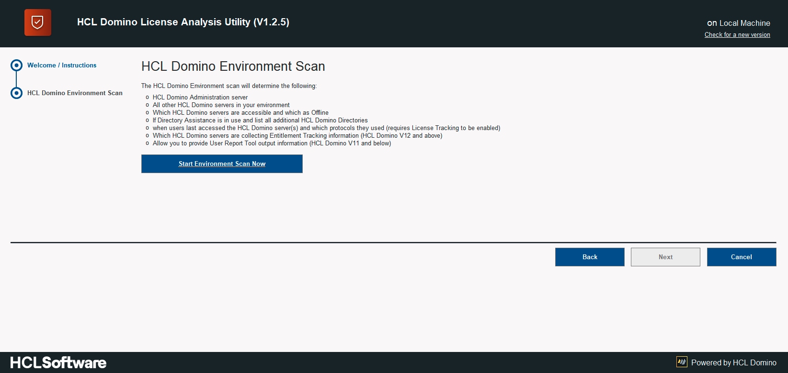
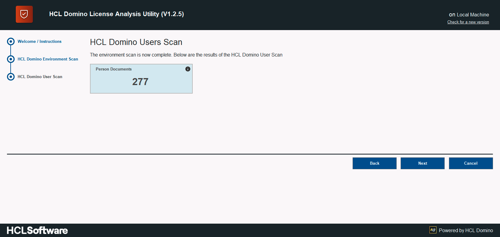

Sie lesen die deutsche Übersetzung [dieser Seite](../instructions.md)

<h1>Benutzung des HCL Domino License Analysis Utilities</h1>

  

    Inhalt
  

  {: .text-delta }
1. TOC
{:toc}

___
## Voraussetungen - Herunterladen
Bevor Sie mit dieser Anleitung beginnen können müssen Sie das HCL Domino License Analysis Utility (DLAU) herunterladen und in ihr Notes Data Verzeichnis legen.

DLAU wurde so programmiert, daß es am besten von einem lokalen PC aus gestartet wird ohne es auf ihre HCL Domino server replizieren/kopieren zu müssen.

[Neueste Version laden](https://github.com/HCL-TECH-SOFTWARE/domino-license-analysis-utility-DLAU/releases/latest){: .btn .btn-green }

Prüfen Sie ebenfalls ob Ihre Umgebung die Mindestanforderungen erfüllt [Systemanforderungen](../requirements.md)

___
## Schritt 1 - Starten und signieren
Nachdem DLAU heruntergeladen und in das Notes Daten Verzeichnis kopiert wurde muss es nun vor der Benutzung noch signiert werden.

Die Designelemente im tool müssen elektronisch signiert werden damit das Tool ohne ECL Warnungen benutzt werden kann und damit der Scan im Hintergrund ablaufen kann. Wenn die Analyse läuft können Sie also ihren HCL Notes Client weiter benutzen.

Die einfachste methode das Tool zu signieren ist es die Datenbank direkt im Windows Explorer zu öffnen.
Nach dem öffnen erscheint ein Bildschirm (Siehe Foto) mit einer Anleitung zum signieren des Tools:

Je nachdem wie erfahren sie im Umgang mit elektronischen Signaturen sind wählen sie die entsprechende Option.

___
## Schritt 2 - Erneut öffnen
Nachdem die Anwendung signiert worden ist, schliessen sie diese und öffnen Sie die Anwendung erneut.
Das Icon müsste sich bereits auf ihrer HCL Notes Arbeitsoberfläche befinden.

Sobald Sie DLAU erneut geöffnet haben werden Sie mit folgenden Bildschirm begrüßt

Im Begrüßungstext wird beschrieben welche Schritte das Tool durchführen wird. Es liefert auch informationen darüber welche Schritte unternommen werden können um bessere bzw. klarere Ergebnisse zu erzielen.

Wenn Sie den Scan starten möchten oder wenn Sie weitere Systeme hinzufügen möchten nutzen Sie bitte die Links unter "Important Links"

Um den Scanprozess zu starten klicken Sie bitte auf die Schaltfläche **"Next"** .

___
## Schritt 3 - HCL Domino Umgebung Scannen

Dieser erste Scan ist der "HCL Domino Environment Scan". Damit wird die Umgebung allgemein untersucht, die Servernamen werden ermittelt, Deny Access Gruppen und andere Zugriffsrelevante Einstellungen der Server werden analysiert.

Hier eine Übersicht der Aktionen die in diesem Schritt durchgeführt werden:

* Identifizieren des Domino Administrationsservers
* Namen der Domino server ermitteln
* Verfügbarkeit der Domino Server ermitteln (Online or Offline)
* Directory Assistance Usage auslesen
   * Wenn DA benutzt wird, alle zusätzlichen Domino Directories einlesen
* Prüfen ob HTTP und/oder LDAP protocol verwendet wird
* Namen der verwendenten Deny Access Groups ermitteln 
* Prüfen ob Domino V12 verwendet wird, falls ja, auflisten der Server welche das Entitlement Tracking system verwenden
* Prüfen ob und auf welchen Servern das (alte) Domino License Tracking system verwendet wird

Um den Scan der Umgebung zu starten klicken Sie bitte auf die  Schaltfläche **Start Environment Scan Now** :

Dieser allgemeine HCL Domino Environment scan wird ungefähr **5 minutes** dauern, je nachdem wieviele HCL Domino Servers in Ihrer Umgebung vorhanden sind kann es ggf. schneller gehen oder länger dauern.

Wenn in Ihrer Umgebung zusätzliche Domino Directories (Adressbücher) über Directoy Assistance Katalog eingebunden sind werden wir Sie fragen ob diese Adressbücher für die registrierung **externer Benutzer** verwendet werden.
Ein **Externer Benutzer** ist ein Benutzer welcher kein Mitarbeiter der eigenen Organisation bzw. des eigenen Unternehmens ist sowie in der Zugriffskontrolle nur maximal "Author" Rechte in den HCL Domino Datenbanken besitzt.
Dieser Benutzertyp wird im Lizenzmodell als **Complete Collaboration for External Users** (CCX) bezeichnet.

Falls dies in Ihrer Umgebung der Fall sein sollte, werden Sie folgende Meldung erhalten.:

Wenn Sie an dieser Stelle mit "Yes" antworten, werden Sie im nachfolgendn Dialog aufgefordert weitere Informationen zu den Directories/Adressbüchern anzugeben. z.B. welches der Directories für CCX Benutzer verwendet wird und/oder die Möglichkeit einen bestimmte OrgUnit / Certifier zu definieren der in Ihrer Umgebung für CCX Benutzer verwendet wurde.

Sobald der HCL Domino Environment Scan erfolgreich abgeschlossen wurde, erhalten Sie eine übersicht der bisherigen Erkenntnisse:

To progress to the next scan, click the **"Next"** button.

___
## Schritt 4 - HCL Domino Benutzer Scan
In diesem Schritt, der als "HCL Domino Users Scan" bezeichnet wird werden alle Directories/Adressbücher durchsucht um Personendokumente zu finden.

Die Informationen die ausgelesen werden sind:

* Benutzername
* Email addresse
* Notes Zertifikat und Ablaufdatum (if available)
* Ob ein Internet Password gesetzt ist oder nicht (natürlich wird das Kennwort selbst nicht ausgelesen)
* Name des Domino Directories/Adressbuches in dem das Personendokument gefunden wurde
* Datum wann der Benutzer auf den Domino Server zuletzt zugegriffen hat (nur wenn License Tracking aktiviert ist)
* Protokoll mit dem der Benutzer auf den Domino Server zugegriffen hat (nur wenn License Tracking aktiviert ist)

Weitere Informationen werden erst im späteren Verlauf der Analyse hinzugefügt, mehr dazu in den folgenden Schritten.

Um den HCL Domino Users Scan, zu starten betätigen Sie die Schaltfläche **Start Users Scan Now** :

Sobald der HCL Domino Users Scan erfolgreich beendet wurde, werden die Ergebnisse wie folgt dargestellt:

Um mit dem nächsten Schritt fortzufahren betätigen Sie die Schaltfläche **"Next"** .

___
## Schritt 5 - Deny Access Group Scan
Die Dritte Prüfung betrifft die Deny Access Gruppen. Dieser Scan vergleicht die Konfiguration im Domino Server Dokument mit den gefundenen Deny Access Gruppen um herauszufinden welche der Gruppen tatsächlich verwendet werden um den Zugriff zum Server zu steuern.

Ausgehend von den gefundenen Deny Access Gruppen wird in diesem Schritt jede Gruppe aufgelöst um alle Gruppenmitglieder und verschachtelte Gruppen zu identifizieren. Dieser rekursieve Scan wird solange laufen bis alle Gruppen aufgelöst wurden.

Sobald alle Informationen gefunden wurden, werden Benutzernamen aus den DEny Access Gruppen verglichen mit den Namen der Benutzer die im vorherigen Schritt gefunden wurden um festzustellen ob ein Benutzer Zugriff zum Server hat oder nicht.

Um mit dem Deny Access Group Scan zu starten, betätigen Sie die Schaltfläche **Start Deny Access Scan Now** :

Sobald der Deny Access Group Scan abgeschlossen ist, werden die Ergebnisse wie folgt dargestellt:

Um mit dem nächsten Schritt fortzufahren bentätigen Sie die Schaltfläche **"Next"** .

___
## Schritt 6 - Entitlement Tracking / User Report Tool Scan
Im vierten Schritt "Entitlement Tracking / User Report Tool Scan"wird nach einem von zwei möglichen Datenquellen gesucht:

1. Entitlement Tracking: ist ein Feature des HCL Domino V12 Servers. Sobald ein V12 server gefunden wurde wird dieser Scann durchgeführt

2. User Report Tool Results: ist ein optionales Feature welches auf dem Entitlement Tracking Feature (siehe oben) baseirt und seit HCL Domino V12 zur Verfügung steht. Im Gegensatz zum Entitlement Tracking selbst ist dieses Feature auch rückwärtskompatibel und funktioniert mit Domino servern der Version 9.0.x. Um diese Datenquelle nutzen zu können ist es erforderlich das Tool herunterzuladen und seperat zu starten bevor DLAU verwendet werden kann. 

Sie finden das User Report Tool hier: [User Report Tool - HCL Knowledgebase Article KB0095328](https://support.hcltechsw.com/csm?id=kb_article&sysparm_article=KB0095328)

 
Die Informationen aus dieser Prüfung werden zusammengefasst und stellen die höchste Berechtigung in der **Access Control List (ACL)** dar die ein Benutzer in Ihrer HCL Domino Umgebung erreichen kann. Das ist notwendig um festzustellen ob es sich bei dem Benutzer womöglich um einen CCB oder einen CCX Benutzer handelt.

Um den Entitlement Tracking / User Report Tool Scan zu starten, klicken Sie bitte auf die Schaltfläche **Start Entitlement Tracking / User Report Tool Scan Now** :

Sobald der Entitlement Tracking / User Report Tool vollständig abgeschlossen ist werden die Ergebnisse wie folgt dargestellt:

Um mit dem nächsten Schritt fortzufahren bentätigen Sie die Schaltfläche **"Next"** .

___
## Schritt 7 - Completion of the Wizard and Review of Results
Jetzt sind alle Scanns abgeschlossen. Sie erhalten eine Erfolgsmeldung wie in nachfolgendem Bildschirmfoto dargestellt:

Jetzt haben Sie die Möglichkeit sich die Ergebnisse genauer anzusehen. Drücken Sie dazu auf die Schaltfläche **"View Results"** . 

Die Ergebnisse werden wie folgt dargestellt:

## Fertig

Die vom Tool berechneten Werte repräsentieren ihre aktuelle Umgebung und aktuelle Konfiguration, es ist jedoch möglich das diese Werte nicht ihren zukünftigen Bedarf wiederspiegeln. Lesen Sie deshalb bitte unbedingt den Artikel [Ergebnisse Verstehen](results.md) - und falls sie Fragen zu den ermittelten Ergebnissen haben kontaktieren Sie bitte ihren HCL Ansprechpartner oder öffnen ein Supportticket unter [HCL Customer Support](https://support.hcltechsw.com/csm)

{: mx-auto }