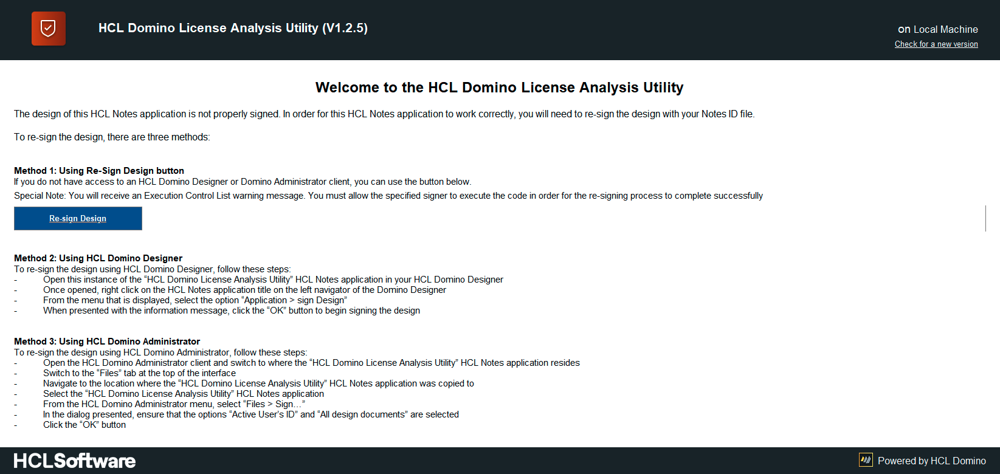
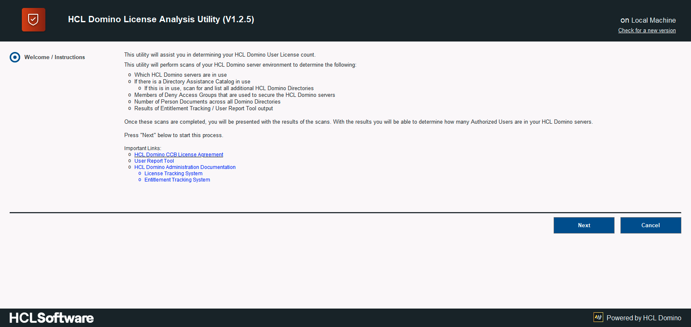
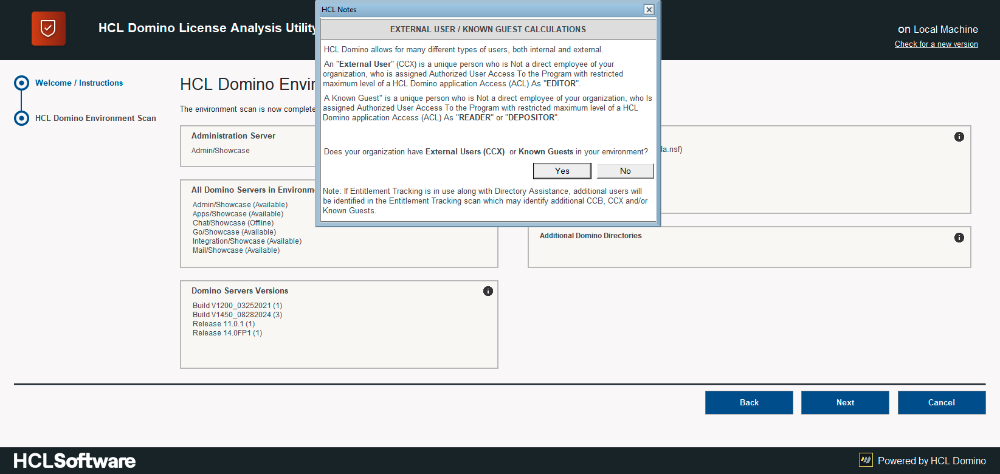
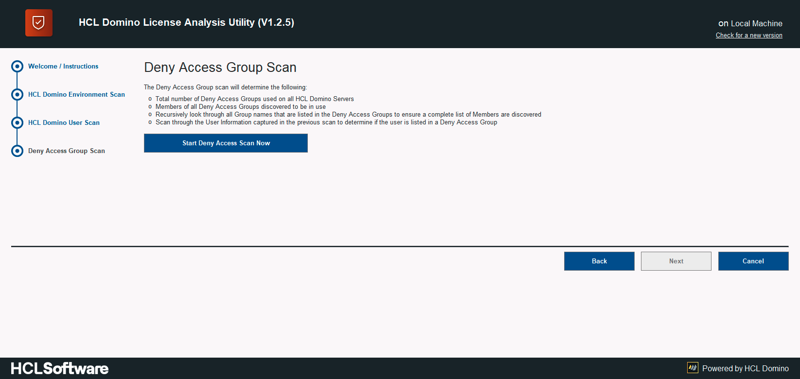
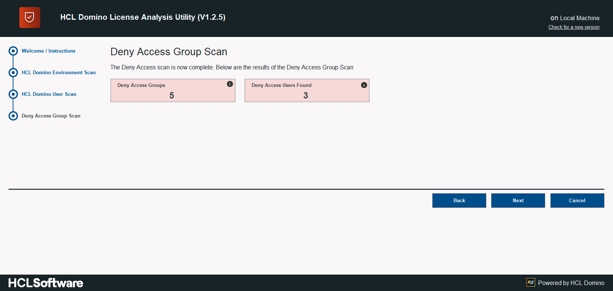
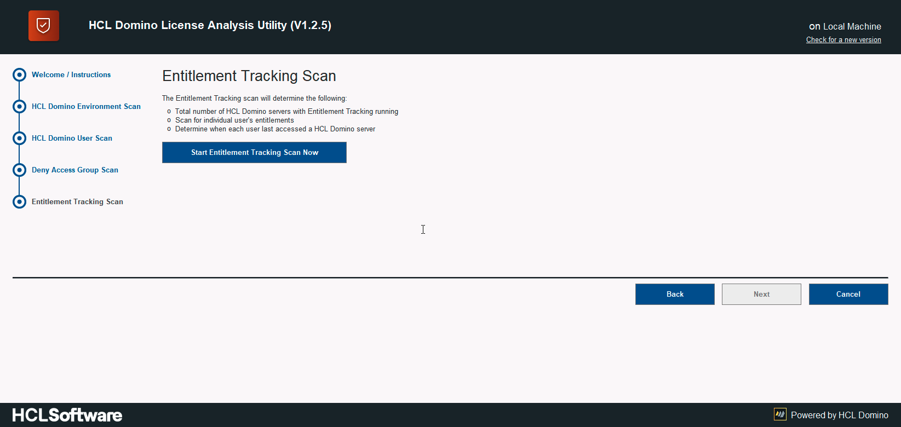

<h1>How to use the HCL Domino License Analysis Utility</h1>

  

    Table of contents
  

  {: .text-delta }
1. TOC
{:toc}

___
## Prerequisites - Download Utility
Prior to continuing through this documentation, you will need to download the HCL Domino License Analysis Utility (DLAU) into your Notes Data directory.

DLAU is designed to work most efficiently on a local hard drive, so there is no need to copy/replicate the DLAU onto any of your HCL Domino servers.

[Download Latest Release](https://github.com/HCL-TECH-SOFTWARE/domino-license-analysis-utility-DLAU/releases/latest){: .btn .btn-green }

Please verify if your environment meets the [system requirements](requirements.md)

___
## Step 1 - Launch and Sign the Design
Once the DLAU file has been downloaded and transfered into your Notes Data directory, it is now time for you to open the utility and resign the design.

It is required to sign the design elements in order for the environment scans to run in the background. Running the scans in the background will allow you to continue using your HCL Notes Client while the processing is taking place.

The simplest method for opening the utility is to double-click on it in the File Explorer application.

Once the utility is open, you should see the screen below which contains instructions on how to resign the design of the utility:

Depending on your experience level and how much you want to moniutor the re-singing process, select the appropriate method listed.

___
## Step 2 - Re-Open
Now that the design of the DLAU has been signed, you will need to re-open the utility. When you initially opened the DLAU a Domino applicaiton icon will have been added to your Workspace. Locate and open the DLAU.

Once opened, you will be presented with the following screen:

Once opened, you will be provided some high level information about what the utility will be performing. It also provides you with information on other systems that can contribute to a cleaner result from the DLAU. If you would like to run and/or install the additional systems, click on the links under the "Important Links" area.

To begin the scanning processes, click the **"Next"** button.

____
## Step 3 - HCL Domino Environment Scan
The first scan is the "HCL Domino Environment Scan". This scan concentrates on the HCL Domino servers, their availability, usage of Deny Access Groups, and whether they are properly secured.

A listing of what is scanned during this step is below:

* Discovery of Domino Administration server
* Domino server names
* Domino Server availability (Online or Offline)
* Directory Assistance Usage
   * If DA is in use, discover all additional Domino Directories
* Check for secured HTTP and LDAP protocols
* Capture the name(s) of the Deny Access Groups that are in use on the Domino servers
* Determine if Domino V12 is in use and, if it is, list which Domino servers are using the Entitlement Tracking system
* Determine if Domino License Tracking system is running and on which Domino servers

To begin the HCL Domino Environment Scan, click the **Start Environment Scan Now** button:

The HCL Domino Environment scan will take approximately **5 minutes** to complete, depending on the number of HCL Domino Servers in your environment.

If your organization is using additional Domino Directories via the Directory Assistance Catalog, you will be asked if any of those additional Domino directories are being used to register **External Users**. An **External User** is a user that is not a direct employee of your organization and has a maximum Access Control List level of "Author" to the Domino applications on your HCL Domino servers. This is better known as a **Complete Collaboration for External Users** (CCX) license.

If this is the scenario in your environment, you will be presented the following message:

If you select "yes" as your answer, you will be presented with the following dialog which will provide you the opportunity to select either the Additional Domino Directory for CCX users and/or the ability to select the OrgUnit / Org that identifies the CCX users:

Once the HCL Domino Environment Scan is complete, you will be presented with the results, as shown below:

To progress to the next scan, click the **"Next"** button.

___
## Step 4 - HCL Domino Users Scan
The second scan is the "HCL Domino Users Scan". This scan will process all Domino Directories and aggregates information from the Person documents it finds.

The information that is aggregated is as follows:

* User's name
* User's Email address
* Notes Certificate Expiry Date (if available)
* Indication if the Internet Password is set (not the actual Internet Password)
* Domino Directory where the Person document resides
* Date when user last accessed a Domino Server (only if License Tracking is enabled)
* Protocols that the user's used to access the Domino servers (only if License Tracking is enabled)

Additional information is aggregated about each user during the subsequent scans.

To begin the HCL Domino Users Scan, click the **Start Users Scan Now** button:

Once the HCL Domino Users Scan is complete, you will be presented with the results, as shown below:

To progress to the next scan, click the **"Next"** button.

___
## Step 5 - Deny Access Group Scan
The third scan is the "Deny Access Group Scan". This scan looks at the values stored on the Server document aggregated data to determine what Deny Access Groups are in use to secure the Domino servers. 

Using the list of Deny Access Groups that are in use, the scan will retrieve the Deny Access Groups, all members of those Groups and also determine if there are Group names within the Deny Access Groups. If additional Group names are discovered, the scan will also retrieve the information for those additional Groups. This recursive scanning of Groups will continue until all Group names have been processed.

Once all this information is retrieved, each of the users that were discovered during the "HCL Domino Users Scan" are crossed referenced against the Members of the Deny Access Groups that were discovered. This cross reference determines if the user is listed in a Deny Access Group. If a user's name is discovered, the User information will be updated to indicate this.

To begin the Deny Access Group Scan, click the **Start Deny Access Scan Now** button:

Once the Deny Access Group Scan is complete, you will be presented with the results, as shown below:

To progress to the next scan, click the **"Next"** button.

___
## Step 5 - Entitlement Tracking / User Report Tool Scan
The fourth and final scan is the "Entitlement Tracking / User Report Tool Scan". This scan will look at one of the next two systems:

1. Entitlement Tracking: this is a new system that was introduced in HCL Domino V12. If the client is using HCL Domino V12, this scan will always occur

2. User Report Tool Results: this is an optional system that is based on the Entitlement Tracking system that is in HCL domino V12, but has been made to be backwards compatible to Domino V9.x. the client will need to download and run the User Report Tool prior to using the DLAU. 

Here is a link to the User Report Tool: [User Report Tool - HCL Knowledgebase Article KB0095328](https://support.hcltechsw.com/csm?id=kb_article&sysparm_article=KB0095328)

 
The information that this scan retrieves will display the highest **Access Control List (ACL)** level that each user has to the HCL Domino environment. This is useful in determining if the user is a CCB or a CCX license user.

To begin the Entitlement Tracking / User Report Tool Scan, click the **Start Entitlement Tracking / User Report Tool Scan Now** button:

Once the Entitlement Tracking / User Report Tool is complete, you will be presented with the results, as shown below:

To progress to the next screen, click the **"Next"** button.

___
## Step 6 - Completion of the Wizard and Review of Results
Now that all scans are complete, you will be presented with a screen stating that "All Scans Are Complete", as shoen below:

To review the results of the Scans, click on the **"View Results"** button. When that button is cliekced, you will be presented with the full results of the DLAU scans, as shown below:

## Finally

The figures calculated by the tool are representing your current environment configuration. However, they may not meet your future configuration, so please see [understanding the results](results.md) - if in doubt, please contact your HCL representative or open a support ticket at [HCL Customer Support](https://support.hcltechsw.com/csm)

{: mx-auto }