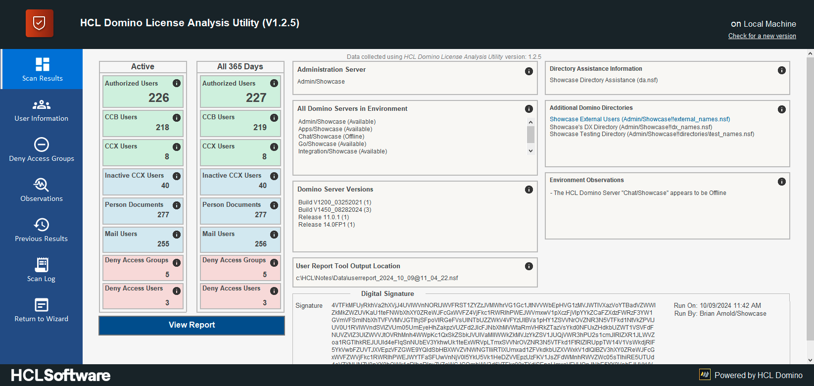
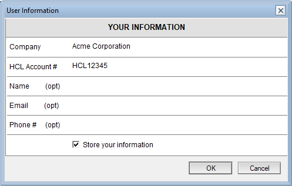

<h1>Reporting the Results of the HCL Domino License Analysis Utility</h1>

  

    Table of contents
  

  {: .text-delta }
1. TOC
{:toc}

___
Once you are satisfied with the results of the DLAU Scans, you will need to report the results to HCL for future licensing discussions.

Within the DLAU there are two methods for submitting the information. Below are the instructions for submitting the results.

___
## Step 1 - Provide Additional Company Information
In order for our HCL Sales Team to be able to contact your organization, you will need to provide information that will assist them in contacting you.

On the "Scan Results" screen, there will be a button labeled "View Report", as shown in the image below:

When that button is clicked for the first time after the scanning process is completed, the user will be presented with a dialog box where they can provide information about their organization, as shown in the image below:

At a minimum, you will need to provide your Company Name and HCL Account #. For a faster response from HCL, you can also provide your Name, Email Address and Direct Phone #. These three (3) values are optional.

Once the information is provided, click on the "OK" button to be taken to the "Scan Results" page.

___
## Step 2 - Understanding the Scan Report
Once you supply your organization's information, you will be presented with the "Your License Information" Report page.

On this page will be a summary of the License Counts and Company Information provided on the left side of the screen. This is a representation of the "Scan Results" page.

On the right side of the page are instructions on how to provide these results to HCL.

Below is an image of what you should see:

___
## Step 3 - Submitting the Scan Report
There are two (2) methods for providing these results to HCL:

___
### Option A: Send Via Email
The most efficient and fastest method to provide your License Information to HCL is to submit it as an email.

When you click on the "Submit Report" button, the information that is shown on the current page is placed into the Body of a new Email message. The "Send To" and "Subject" values are also set.

When you are ready, simply send the Email message to HCL.

Below is an example of what the Email message will look like:

{: .notice }
This method CANNOT be used by U.S. Federal Government customers. If you are a U.S. Federal Government customer, please refer to the next submission option.

___
### Option B: Send as PDF
A second option for submitting your License Information is to provide the results as a PDF file. To use this option, click on the "Print Report" button. This will invoke the Print Document functionality in the Notes Client. 

When the "Print Document" dialog is displayed, be sure to select a PDF Rendering printer from the list provided, as shown below:

Once the PDF of the report has been created, it can be provided to your HCL Sales Representative directly.

{: mx-auto }