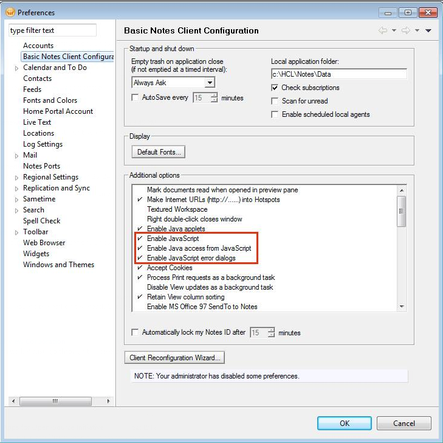

<h1>System Requirements</h1>
The following requirements must be met in order to run the utility.

  

    Table of contents
  

  {: .text-delta }
1. TOC
{:toc}

---

## Software

- Windows 7 or higher
- Notes Client version 7.0.2 or higher
- Domino Server version 7.0 or higher

## Access rights

- READ access to the Domino Directory and other system databases
- ACL role "[DenyAccessRead]" in the Domino Directory
- Group membership in the "LocalDomainAdmins" Group

## JavaScript Support in Notes Client Preferences

We use JavaScript within DLAU to move through the different scan processes, therefore JavaScript support must be enabled.

If JavaScript is not enabled for the Notes Client, DLAU will not work.

In the Notes Client, this can be enabled by opening the Notes Client Preferences (from the Notes Client Menu, select "File -> Preferences...") and then enabling three (3) JavaScript options, as shown below:

## Additional Requirements for CCX/Known Guest Calculations

In order to properly calculate CCX and Known guests in a Domino environment, additional information must be provided to DLAU for analysis.

CCX users have certain rules that must be adhered to. Specifically, a CCX User is only allowed to have a maximum Access Control List level of "Author" to all the Domino applications. DLAU also uses information about the CCX Users' last successful login to a Domino server to calculate if the CCX user is Active or Inactive.

Similarly, a Known Guest is only allowed to have a maximum Access Control List level of "Author" to all the Domino applications.

To provide the information that DLAU requires to make these calculations, two additional systems must be running in your Domino server environment:

* License Tracking System: this is a system that is built into Domino (since V7 I believe) that captures the date, time, and protocol that was used when a user authenticates to Domino
 
[License Tracking System Setup Instructions](https://help.hcltechsw.com/domino/9.0.1/admin/admin/conf_licensetracking_t.html)

* Entitlement Tracking (if Domino V12) or the results from the user Report Tool: These systems will provide DLAU with each Domino user's highest Access Control List level. This is important only if the client has External Users (CCX licenses) 

[Click here for more information](https://opensource.hcltechsw.com/domino-license-analysis-utility-DLAU/instructions/#step-6---entitlement-tracking--user-report-tool-scan)